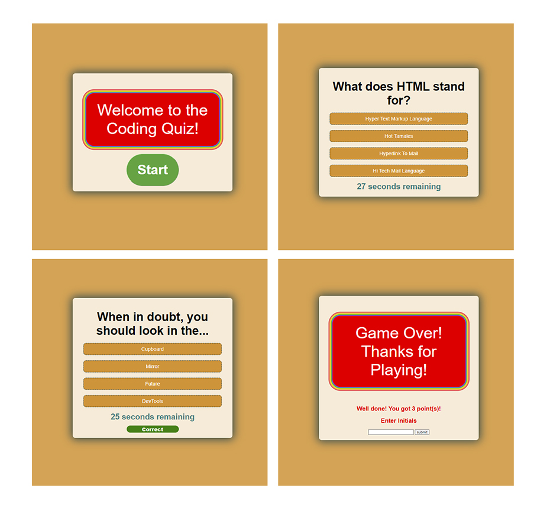

#  Module 4 : Javascript: Coding Quiz App

## Overview

I have created a timed quiz app using javascript with questions based on coding fundamentals.

## Installation

N/A

## Usage

The page loads upon landing and the game and timer begin by clicking the start button. You can answer each question by clicking one of the options and you will be told if it is correct or incorrect and moved on to the next question. Incorrect answers will result in time being deducted from the timer.

At the end of the game your score is displayed as well as the ability to enter your name which will be tied to your score in local storage.

### Links

 [Github Page](https://sashdc.github.io/JS-Quiz/)
 
 [Github Repo](https://github.com/sashdc/JS-Quiz)

 ## Credits

Cherian, Saharsh

[Creator Github](https://github.com/sashdc)

## License

N/A
